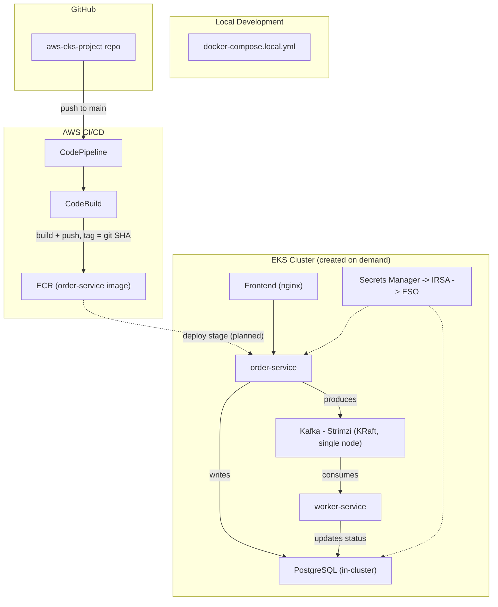

# AWS EKS Cloud Native Platform

## Project Status

[](https://aws.amazon.com/)

**Current Version:** 0.2.0

**Status:** Core platform infrastructure is live and verified on EKS: secrets sync from AWS Secrets Manager through IRSA and External Secrets Operator, PostgreSQL is running with synced credentials, and a single-node Kafka cluster (Strimzi, KRaft mode) is up with a working topic. App services (order-service, worker-service, frontend) and the pipeline's deploy stage are next. The three-tier app still runs locally via docker-compose for fast iteration.

## Introduction

This project is a cloud native platform built on AWS EKS, designed to demonstrate hands on skills. It covers IaC, CI/CD pipeline design, container orchestration, event driven messaging with Kafka, and security practices like least privilege IAM and secret management, all built with a strict focus on cost control and full reproducibility.
The app itself (a simple order processing flow) exists mainly as something real to deploy and observe. The actual focus of this project is DevOps, not front-end development.

## Table of Contents

1. [Skills Demonstrated](#skills-demonstrated)
2. [Architecture](#architecture)
3. [Repository Structure](#repository-structure)
4. [Technology Stack](#technology-stack)
5. [CI/CD Pipeline](#cicd-pipeline)
6. [Security](#security)
7. [Engineering Challenges and Design Decisions](#engineering-challenges-and-design-decisions)
8. [Planned Improvements](#planned-improvements)
9. [AI Diligence Statement](#ai-diligence-statement)

## Skills Demonstrated

- IaC with CloudFormation, including automated security scanning with Checkov
- AWS native CI/CD pipeline design (CodePipeline, CodeBuild) with GitHub as the source
- Container orchestration on EKS
- Kubernetes manifest management with Helm and Kustomize
- Event driven architecture using Kafka (producer/consumer pattern)
- Least privilege IAM design, split by responsibility between build and deploy roles
- Cost conscious infrastructure design
- Bash scripting for reproducible create/destroy workflows
- Local development workflow using Docker Compose, independent of the cloud

## Architecture

The application follows a simple producer/consumer pattern. A frontend calls an API service (order-service), which writes to PostgreSQL and publishes a message to Kafka. A worker service consumes that message and updates the record's status. This is intentionally minimal.
At the infrastructure level, CloudFormation provisions the ECR repository, artifact storage, and IAM roles. A separate CloudFormation stack provisions the CI/CD pipeline itself. EKS is provisioned separately via eksctl, deliberately kept out of CloudFormation so the cluster's expensive, short lived lifecycle (created only during active work) is decoupled from the long lived resources like ECR and IAM.
Secrets never enter the cluster as plaintext. AWS Secrets Manager holds the actual credentials, an IAM role scoped to that single secret is attached to a Kubernetes service account through IRSA, and External Secrets Operator syncs the value into a native Kubernetes Secret that the app consumes through a normal env var reference. Nothing in git, in a Helm values file, or in a manifest ever holds a real credential.



## Repository Structure

```
infra/cloudformation/    CloudFormation templates (foundation resources, pipeline)
infra/eksctl/            EKS cluster configuration
pipeline/                CodeBuild buildspecs
ansible/                 Cluster add-on bootstrap playbooks
helm/                    Helm charts for each service
k8s/overlays/            Kustomize overlays (dev/prod)
apps/api/                order-service (producer)
apps/worker/             worker-service (consumer)
apps/frontend/           Static frontend
scripts/                 teardown.sh, rebuild.sh
docs/                    Diagrams and design decision notes
docker-compose.local.yml Local only stack for testing without AWS
```

## Technology Stack

- **IaC:** CloudFormation, eksctl
- **CI/CD:** CodePipeline, CodeBuild, GitHub (source, via CodeConnections)
- **Orchestration:** Amazon EKS, Helm, Kustomize
- **Messaging:** Apache Kafka
- **Secrets:** AWS Secrets Manager, External Secrets Operator, IRSA
- **Automation:** Ansible
- **Monitoring:** kube-prometheus-stack (Prometheus, Grafana, Alertmanager)
- **Logging:** Fluent Bit to CloudWatch Logs
- **Security scanning:** Checkov (IaC), TruffleHog
- **Languages/runtime:** Node.js (Express, KafkaJS), PostgreSQL
- **LLMs:** Claude, ChatGPT, Gemini

## CI/CD Pipeline

A push to `main` triggers CodePipeline via a CodeConnections link to GitHub. The pipeline currently has two stages:
1. **Source:** pulls the latest commit from GitHub
2. **Build:** CodeBuild builds the order-service Docker image and pushes it to ECR, tagged with the short git commit SHA (not `latest`, since the ECR repository enforces immutable tags)
**LATER:** Deploy stage (separate CodeBuild project, Helm-based deployment to EKS, only runs while a cluster exists)

## Security

### Secrets Management

AWS Secrets Manager holds the actual credential values. An IAM policy scoped to a single secret ARN (read only, `secretsmanager:GetSecretValue` and nothing else) is attached to a Kubernetes service account through IRSA. External Secrets Operator watches a `ClusterSecretStore` backed by that service account and syncs the secret into a namespaced Kubernetes Secret, which PostgreSQL and worker-service consume via `secretKeyRef`. No credential is ever written to a file, a Helm values file, or committed to git.

A `ClusterSecretStore` is used instead of a namespaced `SecretStore` for a specific reason: ESO's admission webhook won't let a namespaced `SecretStore` reference a service account outside its own namespace, and the IRSA-bound service account lives in `external-secrets` while the synced secret needs to land in `default`.

### IAM and Access Control

CI/CD IAM roles are split by responsibility. The CodeBuild role can push to ECR and write to the artifact bucket only, with no Kubernetes access. The CodePipeline role can invoke CodeBuild and use the GitHub connection only. All CloudFormation templates are scanned with Checkov before deployment, with any accepted exceptions documented inline with reasoning.

IRSA is also used for in-cluster AWS access. The External Secrets Operator's Kubernetes service account is bound to a dedicated IAM role through eksctl's `iam.serviceAccounts` config, scoped to a single Secrets Manager ARN, so the role's whole lifecycle is created and destroyed with the cluster instead of being managed by hand.

**LATER:** IRSA, deploy role access into EKS

### Network Exposure

**LATER:** How the app is reachable

## Engineering Challenges and Design Decisions

**Cost driven redesign:**
The original plan assumed a larger, always available EKS setup. As it became clear the EKS control plane has no free tier at all, the project was redesigned around a minimal footprint: small on demand nodes, no NAT Gateway, no load balancer, and a strict habit of tearing the cluster down between work sessions using create/destroy scripts.

**AWS Free Plan instance restrictions:** 
New AWS accounts are limited to free tier eligible instance types unless certain conditions are met. This surfaced as a failed node group creation and required adjusting node sizing.

**T3 burstable CPU credits:** 
T3 instances default to "unlimited" credit mode, which can bill extra if sustained CPU usage exceeds baseline. Nodes are explicitly set to "standard" mode instead, trading potential throttling for predictable cost.

**Bitnami image deprecation:** 
Bitnami moved most of its container catalog behind a paid tier in 2025, breaking a planned dependency on `bitnami/kafka` for local testing. Local Kafka testing was moved to Apache's own official image instead.

**Licensing:** 
An open source reference app was initially considered for the demo application, but lacked a license file. Rather than risk redistributing unlicensed code in a public repo, a small purpose-built app was written by Claude instead.

**metrics-server: EKS addon over Helm.** Originally planned to install metrics-server via Helm alongside the other add-ons, for consistency. It turns out metrics-server already ships as an EKS-managed addon, and running the Helm chart on top of it caused ownership conflicts on the resources it manages. Switched to relying on the addon, declared in the eksctl cluster config so it's still IaC-tracked, and removed the Helm-based role entirely rather than leaving it disabled in place.

**No default StorageClass on a fresh EKS cluster.** PostgreSQL's PVC stayed stuck in `Pending` because eksctl doesn't install the EBS CSI driver by default, and even once it's added, nothing marks a StorageClass as default automatically. Fixed by adding the driver as a managed EKS addon and creating a `gp3` StorageClass with `is-default-class` set explicitly.

**External Secrets CRD version drift.** Manifests written against `external-secrets.io/v1beta1` failed with "no matches for kind" even though the CRDs were installed, because the chart version in use only serves `v1`. Traced by checking `served: true/false` per version on the CRD directly, then updated the manifests.

**Strimzi operator crash on Kubernetes 1.34.** The Strimzi 0.45.0 operator crashed on startup with a Jackson deserialization error, unable to parse a new `emulationMajor` field EKS 1.34 added to its version response. This is a known upstream issue in Strimzi's bundled Kubernetes client. Fixed by upgrading to Strimzi 0.51.0 and adding `STRIMZI_KUBERNETES_VERSION` as an explicit env var as a safety net, both encoded in the Ansible role rather than patched by hand on a live pod.

**ZooKeeper removal and Kafka version pinning.** Strimzi dropped ZooKeeper support entirely as of 0.46.0, so the original `Kafka` CR (written against 0.45.0) had to be rewritten around `KafkaNodePool` and KRaft mode. Separately, the broker refused to start with `version: 3.8.0`, since 0.51.0 only supports a specific whitelist of Kafka versions. Both issues trace back to the same mistake: bumping the operator version without checking its compatibility matrix against everything downstream of it.

**Helm does not upgrade CRDs.** After bumping the Strimzi chart version, the operator pod ran fine but the Entity Operator crash looped with 404s against the Kafka API. Helm upgrades a chart's Deployment but doesn't touch CRDs by default. Fixed by applying the matching CRD bundle directly as its own Ansible task, ordered before the Helm install so it can't race the operator's startup again.

**teardown.sh scoped too broadly.** The teardown script was deleting the CloudFormation foundation stack (ECR, S3, IAM) on every run, not just the EKS cluster. This stayed hidden until CloudFormation's own export-dependency protection blocked a delete and surfaced the mistake. Fixed by scoping teardown.sh to only the eksctl-managed cluster, with foundation/pipeline stack removal left as a separate, deliberate script reserved for final cleanup.

**Postgres data does not persist across sessions.** Postgres runs on an EBS-backed PVC, which gets destroyed along with the cluster on every teardown, by design, since the cluster itself only exists during active work blocks. Accepted deliberately: a demo dataset doesn't need to survive between sessions, and keeping storage ephemeral avoids extra EBS spend on top of the compute budget.

**GitHub App installation vs. authorization.** The CodeConnections GitHub link showed as "Available" and the pipeline ran once on creation, but never triggered on subsequent pushes. The cause: the AWS Connector for GitHub app was authorized but never actually installed to the repository, two distinct steps on GitHub's side. Installing it directly resolved automatic triggering.

## Planned Improvements
**LATER:** Things intentionally left out of scope for this project, such as Vault or Doppler, service mesh, Route53.

## AI Diligence Statement

This project is developed with the assistance of LLMs as engineering tools - Claude, ChatGPT and Gemini. They were used to augment learning, planning, execution, and problem solving, while all architectural decisions, implementation choices and final responsibility remain with me.

Rather than relying on a single conversation or autonomous coding agents, the project followed a structured multi-model workflow. Different models were used for their respective strengths, with dedicated project spaces and multiple chats used where appropriate. Context was intentionally managed through project plans, handoff summaries and reusable prompts, allowing work to continue across free-tier context and usage limits without losing architectural continuity.

I remain responsible for every design decision, line of code and infrastructure change included in this repository.