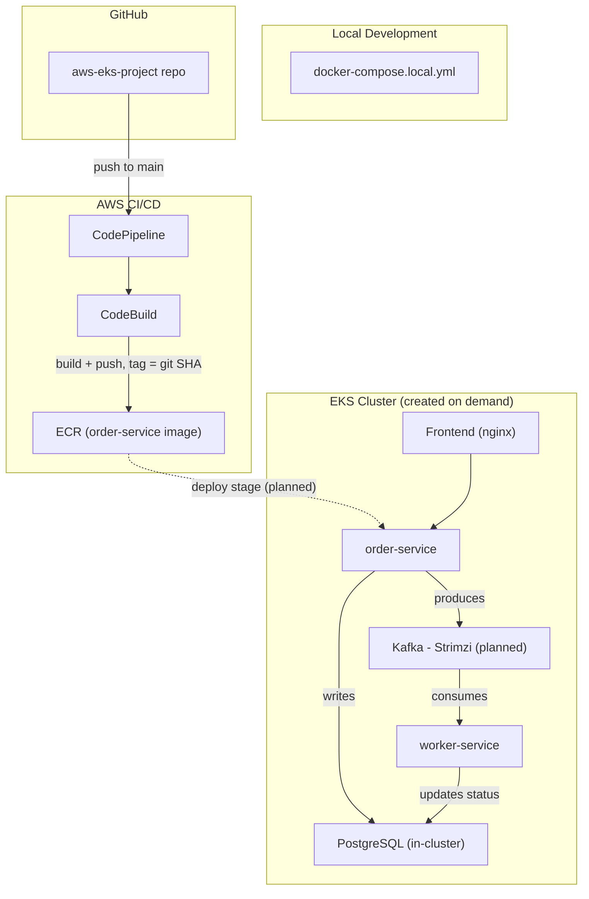

# AWS EKS Cloud Native Platform

## Project Status

[](https://aws.amazon.com/)

**Current Version:** 0.1.0

**Status:** Functioning MVP. Three-tier app (frontend, API, worker) running locally and validated end to end. CI pipeline builds and pushes to ECR on every commit. EKS deployment, Kafka, and monitoring are in progress.

## Introduction

This project is a cloud native platform built on AWS EKS, designed to demonstrate hands on skills. It covers IaC, CI/CD pipeline design, container orchestration, event driven messaging with Kafka, and security practices like least privilege IAM and secret management, all built with a strict focus on cost control and full reproducibility.
The app itself (a simple order processing flow) exists mainly as something real to deploy and observe. The actual focus of this project is DevOps, not front-end development.

## Table of Contents

1. [Skills Demonstrated](#skills-demonstrated)
2. [Architecture](#architecture)
3. [Repository Structure](#repository-structure)
4. [Technology Stack](#technology-stack)
5. [CI/CD Pipeline](#cicd-pipeline)
6. [Security](#security)
7. [Engineering Challenges and Design Decisions](#engineering-challenges-and-design-decisions)
8. [Planned Improvements](#planned-improvements)

## Skills Demonstrated

- IaC with CloudFormation, including automated security scanning with Checkov
- AWS native CI/CD pipeline design (CodePipeline, CodeBuild) with GitHub as the source
- Container orchestration on EKS
- Kubernetes manifest management with Helm and Kustomize
- Event driven architecture using Kafka (producer/consumer pattern)
- Least privilege IAM design, split by responsibility between build and deploy roles
- Cost conscious infrastructure design
- Bash scripting for reproducible create/destroy workflows
- Local development workflow using Docker Compose, independent of the cloud

## Architecture

The application follows a simple producer/consumer pattern. A frontend calls an API service (order-service), which writes to PostgreSQL and publishes a message to Kafka. A worker service consumes that message and updates the record's status. This is intentionally minimal.
At the infrastructure level, CloudFormation provisions the ECR repository, artifact storage, and IAM roles. A separate CloudFormation stack provisions the CI/CD pipeline itself. EKS is provisioned separately via eksctl, deliberately kept out of CloudFormation so the cluster's expensive, short lived lifecycle (created only during active work) is decoupled from the long lived resources like ECR and IAM.



## Repository Structure

```
infra/cloudformation/    CloudFormation templates (foundation resources, pipeline)
infra/eksctl/            EKS cluster configuration
pipeline/                CodeBuild buildspecs
ansible/                 Cluster add-on bootstrap playbooks
helm/                    Helm charts for each service
k8s/overlays/            Kustomize overlays (dev/prod)
apps/api/                order-service (producer)
apps/worker/             worker-service (consumer)
apps/frontend/           Static frontend
scripts/                 teardown.sh, rebuild.sh
docs/                    Diagrams and design decision notes
docker-compose.local.yml Local only stack for testing without AWS
```

## Technology Stack

**IaC:** CloudFormation, eksctl
**CI/CD:** CodePipeline, CodeBuild, GitHub (source, via CodeConnections)
**Orchestration:** Amazon EKS, Helm, Kustomize
**Messaging:** Apache Kafka
**Secrets:** AWS Secrets Manager, External Secrets Operator, IRSA
**Automation:** Ansible
**Monitoring:** kube-prometheus-stack (Prometheus, Grafana, Alertmanager)
**Logging:** Fluent Bit to CloudWatch Logs
**Security scanning:** Checkov (IaC), TruffleHog
**Languages/runtime:** Node.js (Express, KafkaJS), PostgreSQL

## CI/CD Pipeline

A push to `main` triggers CodePipeline via a CodeConnections link to GitHub. The pipeline currently has two stages:
1. **Source:** pulls the latest commit from GitHub
2. **Build:** CodeBuild builds the order-service Docker image and pushes it to ECR, tagged with the short git commit SHA (not `latest`, since the ECR repository enforces immutable tags)
**LATER:** Deploy stage (separate CodeBuild project, Helm-based deployment to EKS, only runs while a cluster exists)

## Security

### Secrets Management

**LATER:** AWS Secrets Manager and External Secrets Operator, secrets synced into the cluster before any app deployment, never stored in plaintext or committed to git

### IAM and Access Control

CI/CD IAM roles are split by responsibility. The CodeBuild role can push to ECR and write to the artifact bucket only, with no Kubernetes access. The CodePipeline role can invoke CodeBuild and use the GitHub connection only. All CloudFormation templates are scanned with Checkov before deployment, with any accepted exceptions documented inline with reasoning.

**LATER:** IRSA, deploy role access into EKS

### Network Exposure

**LATER:** How the app is reachable

## Engineering Challenges and Design Decisions

**Cost driven redesign.** The original plan assumed a larger, always available EKS setup. As it became clear the EKS control plane has no free tier at all, the project was redesigned around a minimal footprint: small on demand nodes, no NAT Gateway, no load balancer, and a strict habit of tearing the cluster down between work sessions using create/destroy scripts.

**AWS Free Plan instance restrictions.** New AWS accounts are limited to free tier eligible instance types unless certain conditions are met. This surfaced as a failed node group creation and required adjusting node sizing..

**T3 burstable CPU credits.** T3 instances default to "unlimited" credit mode, which can bill extra if sustained CPU usage exceeds baseline. Nodes are explicitly set to "standard" mode instead, trading potential throttling for predictable cost.

**Bitnami image deprecation.** Bitnami moved most of its container catalog behind a paid tier in 2025, breaking a planned dependency on `bitnami/kafka` for local testing. Local Kafka testing was moved to Apache's own official image instead.

**Licensing.** An open source reference app was initially considered for the demo application, but lacked a license file. Rather than risk redistributing unlicensed code in a public repo, a small purpose built app was written by Claude instead.

## Planned Improvements
**LATER:** Things intentionally left out of scope for this project, such as Vault or Doppler, service mesh, Route53.
