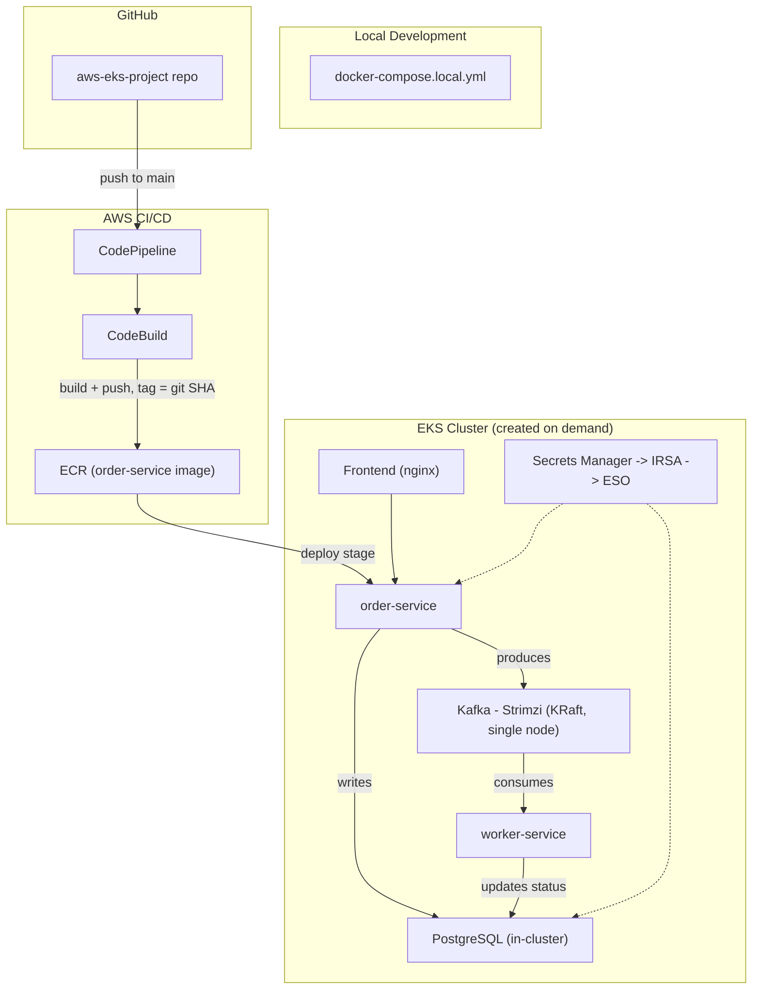
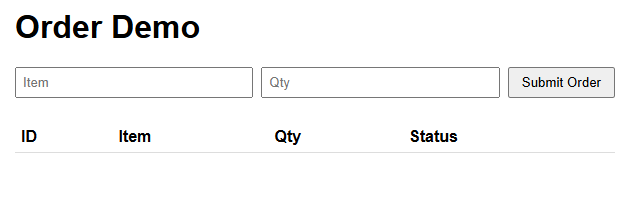
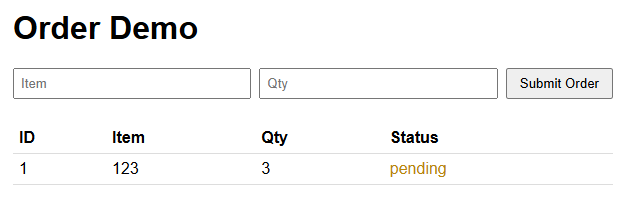
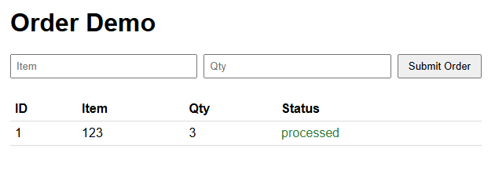
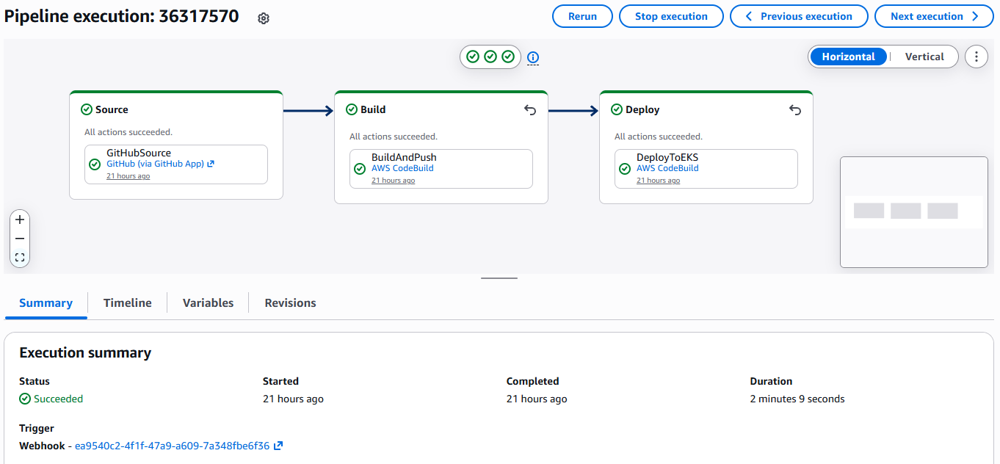
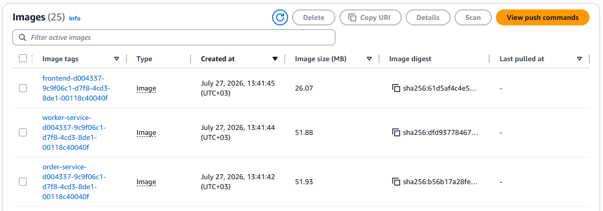

# AWS EKS Cloud Native Platform

## Project Status

[](https://aws.amazon.com/)

**Current Version:** 0.3.0

**Status:** The full pipeline is live and green end to end. A push to `main` builds three images (order-service, worker-service, frontend), and a separate Deploy stage installs all three via Helm against the live EKS cluster, using the exact image tags the Build stage produced. All five workloads (PostgreSQL, Kafka, order-service, worker-service, frontend) have run together successfully and the full order flow has been verified through the deployed app, not just locally. The app is intentionally not publicly exposed; access is via `kubectl port-forward`, and a recorded walkthrough is planned in place of a live demo, consistent with the project's no-ALB, no-public-exposure design.

## Introduction

This project is a cloud native platform built on AWS EKS, designed to demonstrate hands on skills. It covers IaC, CI/CD pipeline design, container orchestration, event driven messaging with Kafka, and security practices like least privilege IAM and secret management, all built with a strict focus on cost control and full reproducibility.
The app itself (a simple order processing flow) exists mainly as something real to deploy and observe. The actual focus of this project is DevOps, not front-end development.

## Table of Contents

1. [Skills Demonstrated](#skills-demonstrated)
2. [Architecture](#architecture)
3. [Repository Structure](#repository-structure)
4. [Technology Stack](#technology-stack)
5. [CI/CD Pipeline](#cicd-pipeline)
6. [Security](#security)
7. [Engineering Challenges and Design Decisions](#engineering-challenges-and-design-decisions)
8. [Planned Improvements](#planned-improvements)
9. [AI Diligence Statement](#ai-diligence-statement)

## Skills Demonstrated

- IaC with CloudFormation, including automated security scanning with Checkov
- AWS native CI/CD pipeline design (CodePipeline, CodeBuild) with GitHub as the source
- Container orchestration on EKS
- Kubernetes manifest management with Helm and Kustomize
- Event driven architecture using Kafka (producer/consumer pattern)
- Least privilege IAM design, split by responsibility between build and deploy roles
- Cost conscious infrastructure design
- Bash scripting for reproducible create/destroy workflows
- Local development workflow using Docker Compose, independent of the cloud

## Architecture

The application follows a simple producer/consumer pattern. A frontend calls an API service (order-service), which writes to PostgreSQL and publishes a message to Kafka. A worker service consumes that message and updates the record's status. This is intentionally minimal.
At the infrastructure level, CloudFormation provisions the ECR repository, artifact storage, and IAM roles. A separate CloudFormation stack provisions the CI/CD pipeline itself. EKS is provisioned separately via eksctl, deliberately kept out of CloudFormation so the cluster's expensive, short lived lifecycle (created only during active work) is decoupled from the long lived resources like ECR and IAM.
Secrets never enter the cluster as plaintext. AWS Secrets Manager holds the actual credentials, an IAM role scoped to that single secret is attached to a Kubernetes service account through IRSA, and External Secrets Operator syncs the value into a native Kubernetes Secret that the app consumes through a normal env var reference. Nothing in git, in a Helm values file, or in a manifest ever holds a real credential.


```mermaid
flowchart TB
    subgraph Local["Local Development"]
        DC["docker-compose.local.yml"]
    end

    subgraph GitHub["GitHub"]
        Repo["aws-eks-project repo"]
    end

    subgraph Pipeline["AWS CI/CD"]
        CP["CodePipeline"]
        CB["CodeBuild"]
        ECR["ECR (order-service image)"]
    end

    subgraph Cluster["EKS Cluster (created on demand)"]
        FE["Frontend (nginx)"]
        API["order-service"]
        Worker["worker-service"]
        PG["PostgreSQL (in-cluster)"]
        Kafka["Kafka - Strimzi (KRaft, single node)"]
        Secrets["Secrets Manager -> IRSA -> ESO"]
    end

    Repo -- "push to main" --> CP
    CP --> CB
    CB -- "build + push, tag = git SHA" --> ECR
    ECR -- "deploy stage" --> API

    FE --> API
    API -- "writes" --> PG
    API -- "produces" --> Kafka
    Kafka -- "consumes" --> Worker
    Worker -- "updates status" --> PG
    Secrets -.-> API
    Secrets -.-> PG
```

### Demo

The flow below runs locally via `docker-compose.local.yml`, the same three-tier architecture described above.



Frontend on first load, before any orders exist.



Right after submitting an order. The status reflects order-service's initial write, before worker-service has consumed the Kafka message.



The same order moments later, updated by worker-service after consuming the message from Kafka and writing the new status to PostgreSQL.


The underlying mechanism: order-service producing to the `orders` topic, worker-service consuming it independently.

The app is intentionally not exposed publicly on AWS (see Network Exposure), so a recorded walkthrough of this same flow running on the live EKS cluster is planned in place of a live link.

## Repository Structure

```
infra/cloudformation/    CloudFormation templates (foundation resources, pipeline)
infra/eksctl/            EKS cluster configuration
pipeline/                CodeBuild buildspecs
ansible/                 Cluster add-on bootstrap playbooks
helm/                    Helm charts for each service
k8s/base/                Base manifests (secrets, storage, Kafka)
k8s/overlays/            Kustomize overlays (dev/prod, not yet built)
apps/api/                order-service (producer)
apps/worker/             worker-service (consumer)
apps/frontend/           Static frontend
scripts/                 rebuild.sh, deploy-infra.sh, teardown.sh, verify-teardown.sh, port-forward.sh
docs/                    Diagrams and design decision notes
docker-compose.local.yml Local only stack for testing without AWS
```

## Technology Stack

- **IaC:** CloudFormation, eksctl
- **CI/CD:** CodePipeline, CodeBuild, GitHub (source, via CodeConnections)
- **Orchestration:** Amazon EKS, Helm, Kustomize
- **Messaging:** Apache Kafka
- **Secrets:** AWS Secrets Manager, External Secrets Operator, IRSA
- **Automation:** Ansible
- **Monitoring:** kube-prometheus-stack (Prometheus, Grafana, Alertmanager)
- **Logging:** Fluent Bit to CloudWatch Logs
- **Security scanning:** Checkov (IaC), TruffleHog
- **Languages/runtime:** Node.js (Express, KafkaJS), PostgreSQL
- **LLMs:** Claude, ChatGPT, Gemini

## CI/CD Pipeline

A push to `main` triggers CodePipeline via a CodeConnections link to GitHub. The pipeline currently has two stages:
1. **Source:** pulls the latest commit from GitHub
2. **Build:** CodeBuild builds the order-service Docker image and pushes it to ECR, tagged with the short git commit SHA (not `latest`, since the ECR repository enforces immutable tags)
3. **Deploy:** a separate CodeBuild project, with its own IAM role that has no ECR access at all, reads the image tags the Build stage produced and runs `helm upgrade --install` for order-service, worker-service, and frontend against the live cluster. The two stages share the pipeline's artifact store, with the Deploy stage taking both the built image manifest and the full source (for the Helm charts) as separate input artifacts.

All three app images are built from a single ECR repository, differentiated by tag prefix (`order-service-`, `worker-service-`, `frontend-`) rather than separate repositories, since the project only needs one. Image tags combine the short git SHA with the CodeBuild build ID, so manually re-running a pipeline execution against the same commit never collides with ECR's immutable tag setting.





## Security

### Secrets Management

AWS Secrets Manager holds the actual credential values. An IAM policy scoped to a single secret ARN (read only, `secretsmanager:GetSecretValue` and nothing else) is attached to a Kubernetes service account through IRSA. External Secrets Operator watches a `ClusterSecretStore` backed by that service account and syncs the secret into a namespaced Kubernetes Secret, which PostgreSQL and worker-service consume via `secretKeyRef`. No credential is ever written to a file, a Helm values file, or committed to git.

A `ClusterSecretStore` is used instead of a namespaced `SecretStore` for a specific reason: ESO's admission webhook won't let a namespaced `SecretStore` reference a service account outside its own namespace, and the IRSA-bound service account lives in `external-secrets` while the synced secret needs to land in `default`.

### IAM and Access Control

CI/CD IAM roles are split by responsibility. The CodeBuild role can push to ECR and write to the artifact bucket only, with no Kubernetes access. The CodePipeline role can invoke CodeBuild and use the GitHub connection only. All CloudFormation templates are scanned with Checkov before deployment, with any accepted exceptions documented inline with reasoning.

IRSA is also used for in-cluster AWS access. The External Secrets Operator's Kubernetes service account is bound to a dedicated IAM role through eksctl's `iam.serviceAccounts` config, scoped to a single Secrets Manager ARN, so the role's whole lifecycle is created and destroyed with the cluster instead of being managed by hand.

The Deploy stage's CodeBuild role has an IAM permission to describe the cluster, but IAM alone doesn't grant it anything inside Kubernetes. An EKS access entry, declared in the eksctl cluster config, is what actually authorizes that role to act inside the cluster, scoped to edit permissions in the `default` namespace only, not cluster-admin. IAM and Kubernetes RBAC are separate systems here, deliberately: IAM decides who's allowed in, the access entry decides what they can do once inside.

### Network Exposure

The app is reachable only via `kubectl port-forward`, not a public endpoint. This was a deliberate choice, not a limitation worked around later: exposing the frontend and order-service via NodePort with a node's public IP was considered as a way to demo the project live from any machine, but rejected, since it would mean opening inbound access on infrastructure that's otherwise intentionally closed, for a benefit that's better served by a recorded walkthrough. A `scripts/port-forward.sh` script forwards both the frontend and order-service locally, matching the same `localhost` addressing already proven in `docker-compose.local.yml`.

## Engineering Challenges and Design Decisions

**Cost driven redesign:**
The original plan assumed a larger, always available EKS setup. As it became clear the EKS control plane has no free tier at all, the project was redesigned around a minimal footprint: small on demand nodes, no NAT Gateway, no load balancer, and a strict habit of tearing the cluster down between work sessions using create/destroy scripts.

**AWS Free Plan instance restrictions:** 
New AWS accounts are limited to free tier eligible instance types unless certain conditions are met. This surfaced as a failed node group creation and required adjusting node sizing.

**T3 burstable CPU credits:** 
T3 instances default to "unlimited" credit mode, which can bill extra if sustained CPU usage exceeds baseline. Nodes are explicitly set to "standard" mode instead, trading potential throttling for predictable cost.

**Bitnami image deprecation:** 
Bitnami moved most of its container catalog behind a paid tier in 2025, breaking a planned dependency on `bitnami/kafka` for local testing. Local Kafka testing was moved to Apache's own official image instead.

**Licensing:** 
An open source reference app was initially considered for the demo application, but lacked a license file. Rather than risk redistributing unlicensed code in a public repo, a small purpose-built app was written by Claude instead.

**metrics-server: EKS addon over Helm.** Originally planned to install metrics-server via Helm alongside the other add-ons, for consistency. It turns out metrics-server already ships as an EKS-managed addon, and running the Helm chart on top of it caused ownership conflicts on the resources it manages. Switched to relying on the addon, declared in the eksctl cluster config so it's still IaC-tracked, and removed the Helm-based role entirely rather than leaving it disabled in place.

**No default StorageClass on a fresh EKS cluster.** PostgreSQL's PVC stayed stuck in `Pending` because eksctl doesn't install the EBS CSI driver by default, and even once it's added, nothing marks a StorageClass as default automatically. Fixed by adding the driver as a managed EKS addon and creating a `gp3` StorageClass with `is-default-class` set explicitly.

**External Secrets CRD version drift.** Manifests written against `external-secrets.io/v1beta1` failed with "no matches for kind" even though the CRDs were installed, because the chart version in use only serves `v1`. Traced by checking `served: true/false` per version on the CRD directly, then updated the manifests.

**Strimzi operator crash on Kubernetes 1.34.** The Strimzi 0.45.0 operator crashed on startup with a Jackson deserialization error, unable to parse a new `emulationMajor` field EKS 1.34 added to its version response. This is a known upstream issue in Strimzi's bundled Kubernetes client. Fixed by upgrading to Strimzi 0.51.0 and adding `STRIMZI_KUBERNETES_VERSION` as an explicit env var as a safety net, both encoded in the Ansible role rather than patched by hand on a live pod.

**ZooKeeper removal and Kafka version pinning.** Strimzi dropped ZooKeeper support entirely as of 0.46.0, so the original `Kafka` CR (written against 0.45.0) had to be rewritten around `KafkaNodePool` and KRaft mode. Separately, the broker refused to start with `version: 3.8.0`, since 0.51.0 only supports a specific whitelist of Kafka versions. Both issues trace back to the same mistake: bumping the operator version without checking its compatibility matrix against everything downstream of it.

**Helm does not upgrade CRDs.** After bumping the Strimzi chart version, the operator pod ran fine but the Entity Operator crash looped with 404s against the Kafka API. Helm upgrades a chart's Deployment but doesn't touch CRDs by default. Fixed by applying the matching CRD bundle directly as its own Ansible task, ordered before the Helm install so it can't race the operator's startup again.

**teardown.sh scoped too broadly.** The teardown script was deleting the CloudFormation foundation stack (ECR, S3, IAM) on every run, not just the EKS cluster. This stayed hidden until CloudFormation's own export-dependency protection blocked a delete and surfaced the mistake. Fixed by scoping teardown.sh to only the eksctl-managed cluster, with foundation/pipeline stack removal left as a separate, deliberate script reserved for final cleanup.

**Postgres data does not persist across sessions.** Postgres runs on an EBS-backed PVC, which gets destroyed along with the cluster on every teardown, by design, since the cluster itself only exists during active work blocks. Accepted deliberately: a demo dataset doesn't need to survive between sessions, and keeping storage ephemeral avoids extra EBS spend on top of the compute budget.

**Rebuilding the cluster does not restore supporting infrastructure.** `eksctl` recreates nodes, addons, and the EKS access entry, but ESO, the secrets sync, PostgreSQL, and Kafka all have to be reapplied by hand every session, since none of them are addons. This stayed implicit until a full pipeline run failed against a freshly rebuilt cluster with nothing but bare nodes on it. Fixed with `scripts/deploy-infra.sh`, which reapplies all of it in the correct order, with explicit wait conditions so the app layer can never race ahead of dependencies it needs.

**Unquoted colons broke buildspec YAML twice.** A shell command like `cut -d: -f1` contains a colon immediately followed by a space, which YAML's plain scalar syntax treats as an ambiguous mapping key, not literal text. This surfaced first in the Deploy stage's buildspec, then again in the Build stage's buildspec when a later fix reintroduced the same pattern without quoting. Fixed by wrapping any buildspec command containing a bare `: ` in double quotes, and validating buildspecs with an actual YAML parser rather than eyeballing them going forward.

**A quiet bug found while re-checking a different one.** While verifying the colon-quoting fix with an actual parser instead of trusting it by eye, a second, unrelated bug turned up in the same file: a multi-line `printf` command relied on shell backslash line continuation, but CodeBuild's buildspec YAML folds multi-line list items into a single line before the shell ever sees them, turning the continuation backslashes into literal stray characters. That silently prepended a leading space to every image URI written into the pipeline's output artifact. Caught and fixed in the same pass as the colon issue, rather than discovering it later as a second, separate failure.

**CodePipeline needs an explicit primary source with multiple input artifacts.** The Deploy stage needs both the built image manifest and the repository's Helm charts, so it was given two input artifacts. CodeBuild silently failed to find its own buildspec until `PrimarySource` was set explicitly, telling CodePipeline which of the two artifacts to check out as the working directory.

**order-service's real dependency didn't match its documented one.** The architecture describes order-service as Kafka-producer-only, with no database access. In practice, the code connects to PostgreSQL on startup regardless. This only surfaced once the app was actually deployed and crash-looping, not from a code review. The Helm chart was updated to match what the application actually does, rather than changing the app to match the diagram.

**GitHub App installation vs. authorization.** The CodeConnections GitHub link showed as "Available" and the pipeline ran once on creation, but never triggered on subsequent pushes. The cause: the AWS Connector for GitHub app was authorized but never actually installed to the repository, two distinct steps on GitHub's side. Installing it directly resolved automatic triggering.

**Helm release naming redundancy, left as-is.** Chart name and release name happen to match for several services (`order-service`, `frontend`), producing redundant resource names like `order-service-order-service` and `frontend-frontend`. Purely cosmetic, no functional impact, and fixing it would mean touching every chart's naming convention for zero real benefit. A deliberate call not to spend time on it given the project's scope and remaining priorities.

## Planned Improvements

- **Multi-account Landing Zone** (AWS Organizations, Control Tower, SCPs): intentionally out of scope. This project runs in a single account by design; a landing zone is an org-governance pattern that doesn't fit a single-cluster, cost-constrained demo project. Worth a separate, dedicated project rather than bolting it onto this one.
- **OPA/Gatekeeper or Kyverno**: policy-as-code admission control (block root containers, enforce resource limits), a natural next step for cluster-level governance.
- **kube-bench**: CIS Kubernetes benchmark checks against the cluster, not implemented due to time scope.
- **Vault or Doppler**: alternative/complementary secrets backends to Secrets Manager.
- **Service mesh** (Istio, Linkerd): mTLS and traffic policy between services.
- **Route53**: DNS management, not needed at this project's scale.
- **ECR lifecycle policy**: expire untagged and old images automatically. Several debugging sessions left behind stray image tags with no cleanup, similar to the lifecycle rule already applied to the S3 artifact bucket.
- **Automated orphaned-volume cleanup**: an EBS volume tied to PostgreSQL's PVC has been left behind by `eksctl delete cluster` more than once. `scripts/verify-teardown.sh` currently detects this manually; folding detection and cleanup directly into `teardown.sh` would remove the manual step.
- **Node size**: currently `t3.small`. A bump to `t3.medium` is planned once the kube-prometheus-stack monitoring workload is added, since current memory usage already sits around 85% per node without it.

## AI Diligence Statement

This project is developed with the assistance of LLMs as engineering tools - Claude, ChatGPT and Gemini. They were used to augment learning, planning, execution, and problem solving, while all architectural decisions, implementation choices and final responsibility remain with me.

Rather than relying on a single conversation or autonomous coding agents, the project followed a structured multi-model workflow. Different models were used for their respective strengths, with dedicated project spaces and multiple chats used where appropriate. Context was intentionally managed through project plans, handoff summaries and reusable prompts, allowing work to continue across free-tier context and usage limits without losing architectural continuity.

I remain responsible for every design decision, line of code and infrastructure change included in this repository.
